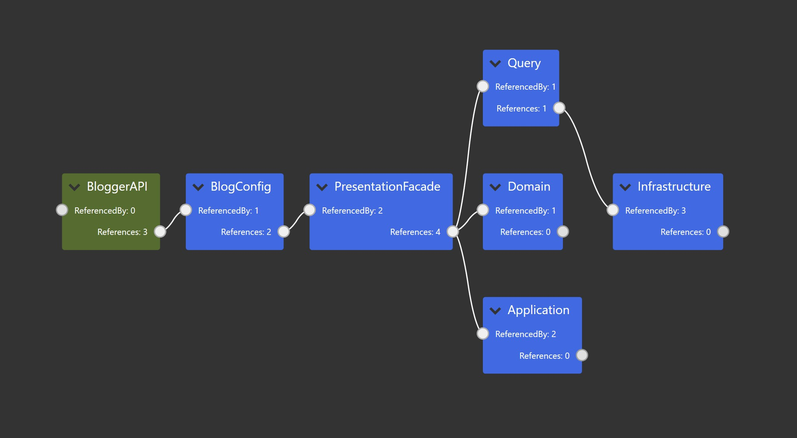

# BloggerAPI 

- Welcome to the BloggerAPI project, a solution for managing your blogging platform efficiently. This project leverages ASP.NET Core, along with SQL, Stored procedures, Dapper, and MediatR. 

## Project Overview 📋
BloggerAPI offers an effective way to manage blog posts and categories, providing essential CRUD functionalities:

- **SQL & Stored Procedures:** The backend is built on a robust SQL database, utilizing stored procedures for efficient data management.
- **Dapper:** Dapper is integrated for lightweight, fast data access, allowing seamless database interaction.
- **MediatR:** MediatR simplifies handling commands and queries, resulting in a more maintainable and testable codebase.
- **MVC Frontend:** An ASP.NET MVC application is included in the same solution, serving as the frontend for consuming the BloggerAPI, providing a user-friendly interface.
- **Docker:** Both the API and MVC projects are containerized with Docker, making the entire solution ready for deployment.

## Download Database scripts here  [Infrastructure/DatabaseScripts](Infrastructure/DatabaseScripts)

## DependencyGraph

